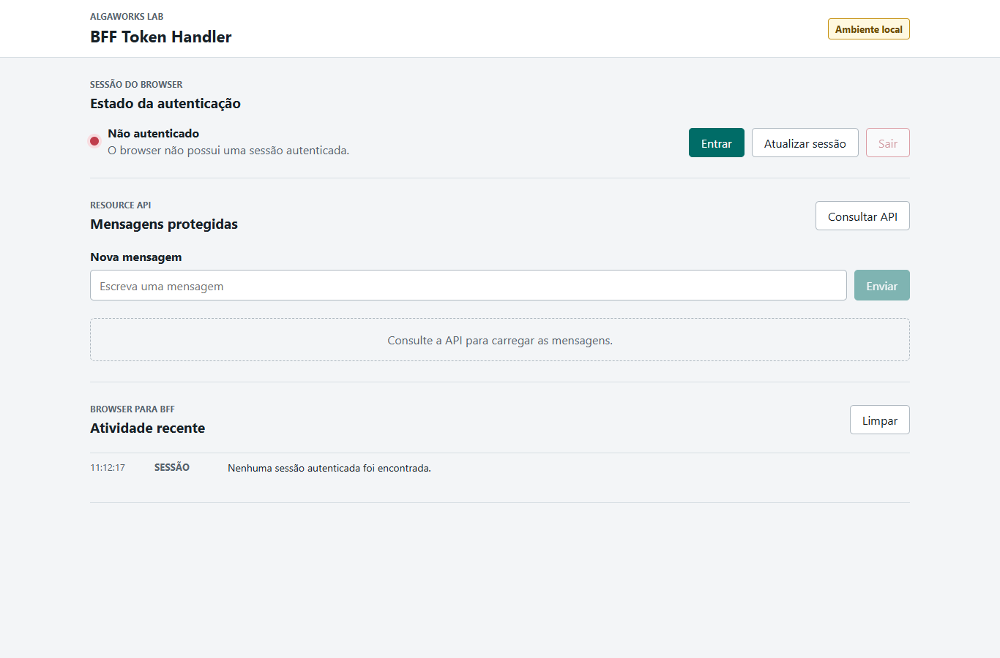
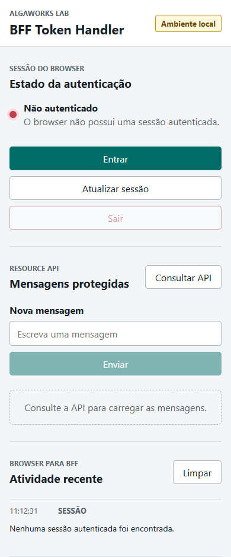
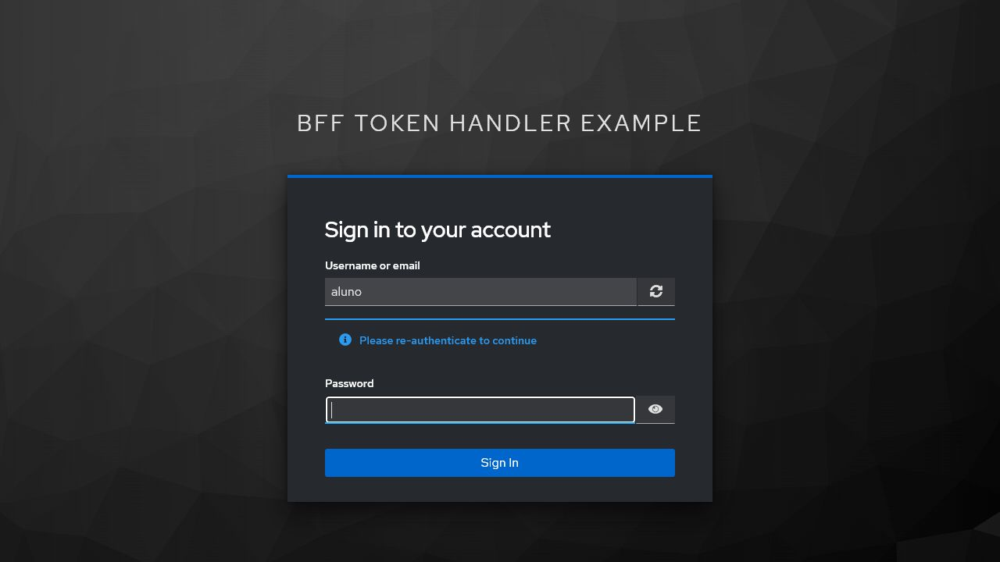
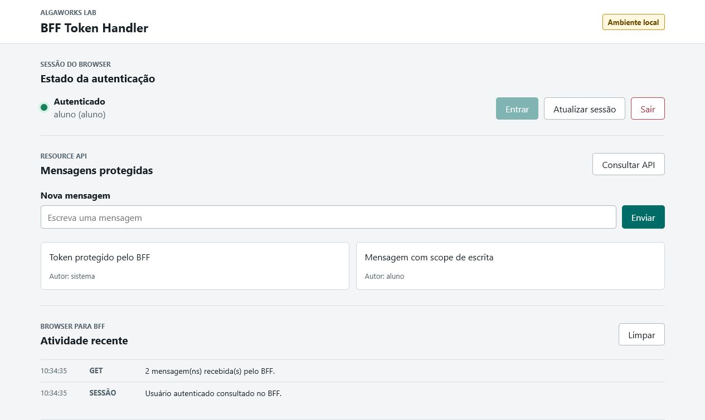
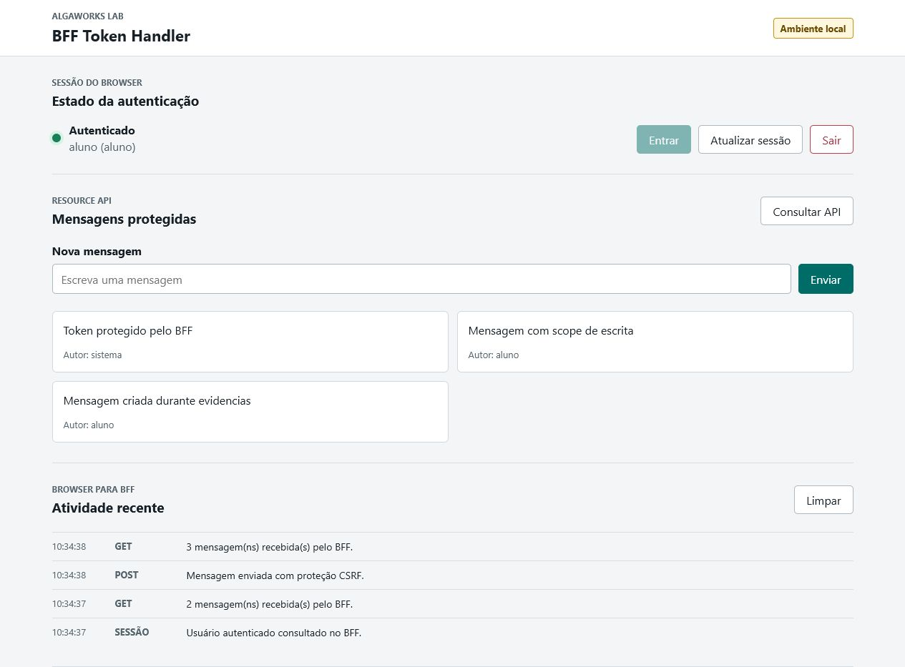
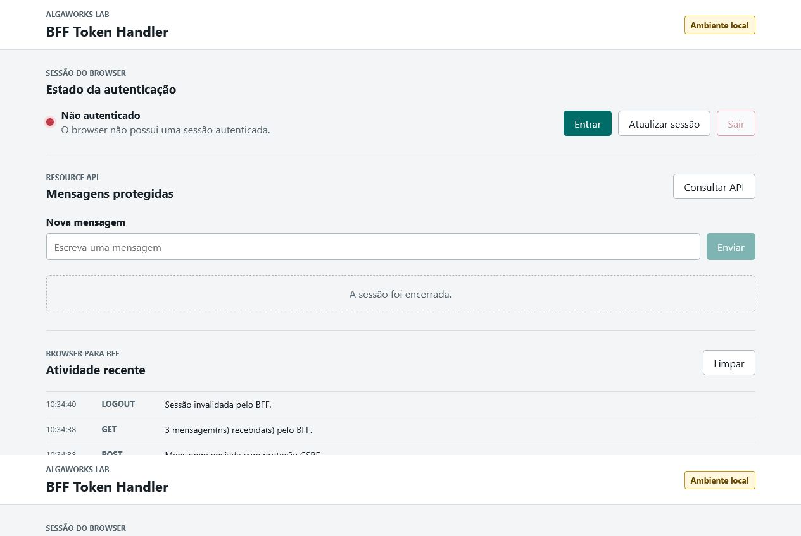

# Manual Guiado - BFF Token Handler

Este manual é o caminho principal para estudar o exemplo.

A ideia é você conseguir executar o projeto, olhar as telas, conferir alguns logs e entender, com calma, por que o browser não precisa guardar tokens OAuth.

As telas e respostas deste manual foram capturadas em uma execução local do projeto. Elas servem como referência visual para você comparar com o seu ambiente.

## 1. Antes De Começar: O Que Estamos Tentando Provar?

Vamos provar uma coisa bem específica:

> O front-end consegue chamar uma API protegida sem guardar `access_token` ou `refresh_token` no browser.

Para isso, o exemplo usa este fluxo:

```text
Browser -> cookie de sessão -> BFF -> Authorization: Bearer -> Resource API
```

Na prática:

- o browser só recebe HTML, CSS, JavaScript e cookie de sessão;
- o JavaScript chama apenas URLs relativas, como `/api/messages`;
- o BFF faz o trabalho de OAuth2 Client;
- o BFF usa `TokenRelay` para chamar a Resource API;
- a Resource API valida JWT, audiência e scopes.

Guarde essa frase, porque ela resume o exemplo inteiro:

> O browser fica autenticado, mas o token OAuth não fica nas mãos do JavaScript.

## 2. Componentes Que Vão Subir Localmente

Você vai trabalhar com três serviços:

```text
Keycloak:     http://localhost:9090
BFF Gateway:  http://localhost:8080
Resource API: http://localhost:8081
```

O papel de cada um:

- Keycloak autentica o usuário e emite tokens.
- BFF serve o front-end, mantém sessão por cookie e encaminha chamadas para a API.
- Resource API é a API protegida, que só aceita JWT válido.

## 3. Preparando O Ambiente

Você precisa ter Docker e Java 21, ou uma toolchain compatível configurada no Gradle.

Antes de começar, vale conferir se estas portas estão livres:

```text
8080 -> BFF Gateway
8081 -> Resource API
9090 -> Keycloak
```

Se alguma delas já estiver ocupada, o serviço correspondente pode falhar ao subir. Por exemplo: se a `9090` estiver em uso, o Keycloak do `docker compose` não vai conseguir iniciar corretamente.

No PowerShell, dentro da raiz do projeto:

```powershell
docker compose up -d
```

Esse comando sobe o Keycloak com o realm de demonstração.

Depois rode os testes e gere os JARs:

```powershell
.\gradlew.bat clean test bootJar
```

Resultado esperado:

```text
BUILD SUCCESSFUL
```

Agora abra dois terminais separados.

No primeiro, suba a Resource API:

```powershell
java -jar resource-api\build\libs\resource-api-0.0.1-SNAPSHOT.jar
```

No segundo, suba o BFF:

```powershell
java -jar bff-gateway\build\libs\bff-gateway-0.0.1-SNAPSHOT.jar
```

Se tudo estiver certo:

- Keycloak responde em `http://localhost:9090`;
- Resource API responde em `http://localhost:8081`;
- BFF responde em `http://localhost:8080`.

## 4. Primeira Conferência: API Direta Sem Token

Antes de abrir o front, vale testar a Resource API diretamente.

```powershell
curl -i http://localhost:8081/messages
```

Resultado esperado:

```text
HTTP/1.1 401 Unauthorized
```

Por que isso é bom?

Porque confirma que a Resource API não aceita chamada anônima. Ela também não conhece cookie do browser nem sessão do BFF. Para ela responder, precisa chegar um JWT válido no header `Authorization`.

## 5. Abrindo O Front Sem Sessão

Acesse:

```text
http://localhost:8080/
```

Você deve ver a tela inicial sem autenticação. A página fica centralizada na tela para facilitar a leitura durante a aula:



Observe:

- o estado aparece como `Não autenticado`;
- o botão `Entrar` está disponível;
- o botão `Sair` está desabilitado;
- o botão `Enviar` também fica desabilitado.

Em uma largura menor, a mesma tela se reorganiza sem barra horizontal:



Até aqui, o browser ainda não tem sessão autenticada no BFF.

## 6. Iniciando O Login

Clique em **Entrar**.

O browser navega para:

```text
/oauth2/authorization/keycloak
```

Esse endpoint não é do front-end. Ele é uma rota do Spring Security no BFF. O BFF começa o fluxo Authorization Code e redireciona o browser para o Keycloak.

Tela de login:



Use:

```text
Usuário: aluno
Senha: alga123
```

Depois do login:

1. Keycloak devolve um authorization code para o BFF.
2. O BFF troca esse code por tokens.
3. O BFF associa os tokens à sessão.
4. O browser recebe cookie de sessão.
5. O browser volta para `http://localhost:8080/`.

Repare no detalhe: quem troca o code por token é o BFF, não o JavaScript.

## 7. Tela Autenticada

Depois do login, a tela deve ficar assim:



Evidência HTTP coletada durante a validação:

```text
GET /bff/user -> HTTP/1.1 200 OK
GET /api/messages -> HTTP/1.1 200 OK
```

O front consultou `/bff/user` para descobrir a sessão atual e `/api/messages` para carregar mensagens protegidas.

Ainda assim, o front continua usando chamadas simples:

```js
fetch("/bff/user");
fetch("/api/messages");
```

Ele não monta `Authorization: Bearer`.

## 8. O Ponto Mais Importante: Browser Sem Authorization

Quando o front chama:

```text
GET /api/messages
```

o browser envia cookie para o BFF, mas não envia `Authorization`.

Log do BFF:

```text
BFF recebeu GET /api/messages | Authorization vindo do browser? false | Cookie de sessao presente? true
```

Leia esse log assim:

- `Authorization vindo do browser? false`: o JavaScript não mandou Bearer token.
- `Cookie de sessao presente? true`: o browser mandou a sessão para o BFF.

Logo depois, a Resource API recebeu outra chamada:

```text
Resource API recebeu GET /messages | Authorization presente? true | Authorization comeca com Bearer? true
```

Leia esse log assim:

- a Resource API recebeu `Authorization`;
- esse `Authorization` começa com `Bearer`;
- portanto, quem colocou o token na chamada foi o BFF.

É aqui que o padrão fica visível.

## 9. Criando Uma Mensagem: CSRF E Scope De Escrita

Agora escreva uma mensagem na tela e clique em **Enviar**.

Exemplo validado:



Por baixo, acontecem duas coisas importantes.

Primeiro, o front busca um token CSRF:

```text
GET /bff/csrf
```

Depois, ele envia a mensagem:

```text
POST /api/messages
X-XSRF-TOKEN: ...
```

Evidências HTTP:

```text
POST /api/messages sem CSRF -> HTTP/1.1 403 Forbidden
POST /api/messages com CSRF -> HTTP/1.1 201 Created
```

### Opcional Avançado: Reproduzindo O 403 Sem CSRF

Depois de fazer login, abra o DevTools do browser e vá na aba **Console**.

Execute este `fetch` manualmente:

```js
fetch("/api/messages", {
  method: "POST",
  headers: {
    "Content-Type": "application/json"
  },
  body: JSON.stringify({
    texto: "Tentativa sem CSRF"
  })
}).then((resposta) => console.log(resposta.status));
```

Resultado esperado no console:

```text
403
```

Por que isso funciona como evidência?

Porque o browser já tem o cookie de sessão depois do login, mas essa chamada não envia o header `X-XSRF-TOKEN`. Então o BFF entende que a operação insegura não está protegida contra CSRF e bloqueia a requisição antes de criar a mensagem.

Por que CSRF aparece aqui?

Porque o browser está autenticado por cookie. Em operações inseguras, como `POST`, precisamos proteger a aplicação contra requisições forjadas.

Além disso, a Resource API exige scope de escrita:

```text
messages:write
```

Então existem duas proteções diferentes trabalhando juntas:

- CSRF protege o uso do cookie no browser;
- scope protege a permissão no token recebido pela Resource API.

## 10. Conferindo Que O Token Não Está No JavaScript

O teste automatizado `ConteudoEstaticoTests` protege esta intenção:

```text
JavaScript não deve conter:
- localStorage
- sessionStorage
- access_token
- refresh_token
- Authorization
```

Isso não substitui uma análise de segurança completa, claro. Mas para o exemplo didático ele é ótimo, porque impede alguém de “resolver” o front colocando token no browser sem perceber.

## 11. Logout Local

Clique em **Sair**.

Resultado esperado:



Evidências HTTP:

```text
POST /logout -> HTTP/1.1 204 No Content
GET /api/messages depois do logout -> HTTP/1.1 401 Unauthorized
```

O BFF invalida a sessão local. Depois disso, o cookie antigo não autentica mais chamadas protegidas.

Importante: este exemplo faz logout local. Logout global no Keycloak fica fora do MVP para não misturar mais um assunto no fluxo principal.

## 12. Resumo Do Fluxo Completo

```text
1. Browser abre http://localhost:8080/
2. Usuário clica em Entrar
3. BFF redireciona para o Keycloak
4. Keycloak autentica o usuário
5. BFF recebe o code e troca por tokens
6. BFF cria sessão por cookie
7. Browser chama /api/messages sem Authorization
8. BFF usa TokenRelay e chama /messages com Bearer
9. Resource API valida JWT, audiência e scopes
10. BFF devolve a resposta para o browser
```

Se você entendeu essa lista, entendeu a ideia principal do BFF Token Handler.

## 13. Evidências Automatizadas

Comando executado:

```powershell
.\gradlew.bat test --no-daemon
```

Resultado:

```text
BUILD SUCCESSFUL
8 actionable tasks: 2 executed, 6 up-to-date
```

Testes que valem observar:

- `ConteudoEstaticoTests`: o front não guarda nem envia token OAuth.
- `EscoposOAuthClientTests`: o BFF solicita `openid`, `messages:read` e `messages:write`.
- `MensagemControllerTests`: a Resource API exige token e scopes corretos.
- `SegurancaBffTests`: o BFF responde `401` para chamadas protegidas sem sessão e exige CSRF no logout.

## 14. Se Algo Der Errado

Alguns sintomas comuns:

### Keycloak não abre

Confira se o container está de pé:

```powershell
docker compose ps
```

### Login funciona, mas `/api/messages` retorna erro

Confira se a Resource API está rodando em `8081`.

### `POST /api/messages` retorna 403

Isso normalmente significa ausência de CSRF. No front do exemplo, o JavaScript busca `/bff/csrf` antes de enviar a mensagem.

### Chamada direta para `8081/messages` retorna 401

Isso é esperado. A Resource API não deve aceitar chamada sem token.

## 15. O Que Este Exemplo Não Tenta Resolver

Para manter a aula focada, ficaram fora:

- React;
- banco de dados;
- Redis;
- sessão distribuída;
- múltiplas APIs;
- CORS e subdomínios;
- logout global no Keycloak;
- refresh token demonstrado manualmente.

Esses temas podem aparecer depois. Aqui o objetivo é enxergar bem o primeiro fluxo.

## Conclusão

O BFF Token Handler não faz o browser “ficar sem autenticação”. Ele muda onde a autenticação sensível fica.

O browser continua autenticado por cookie. O BFF guarda a relação entre sessão e tokens. A Resource API continua protegida por JWT.

Esse é o ganho didático principal:

```text
Browser autenticado, JavaScript sem token OAuth.
```
